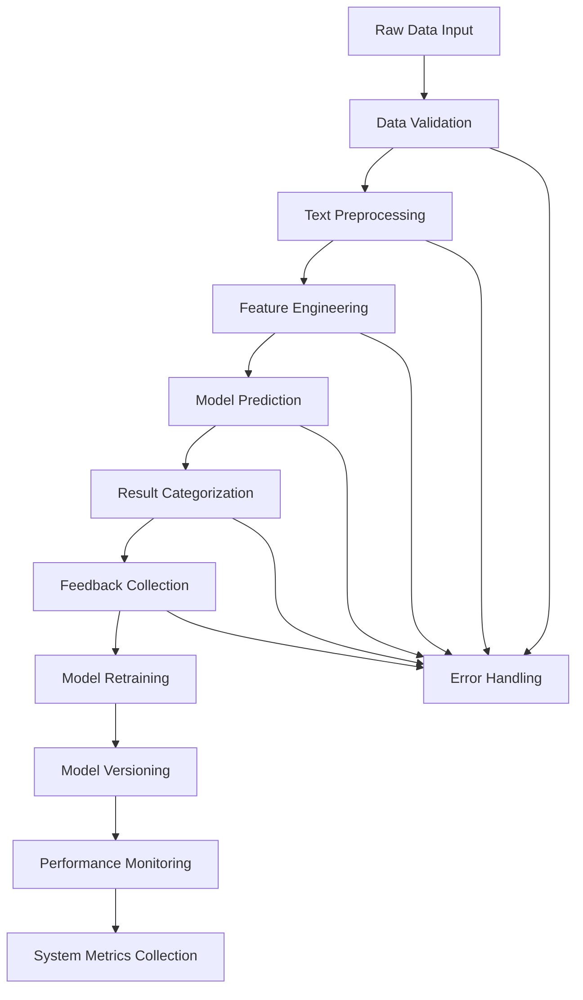

# Application Flow

## Data Categorization Flowchart

## Flow Explanation

1. **Data Input**
   - Accepts raw text and structured data from various sources
   - Validates data format and content using Pandas and custom validation logic

2. **Preprocessing**
   - Cleans and normalizes text data using SpaCy
   - Handles missing values and data inconsistencies
   - Applies text cleaning techniques (lowercasing, stopword removal, lemmatization)

3. **Feature Engineering**
   - Generates text embeddings using transformer models
   - Creates numerical features using feature engineering techniques
   - Stores processed features in feature store for versioning

4. **Model Prediction**
   - Loads current model version from model registry
   - Makes predictions using PyTorch-based transformer model
   - Returns categorized results with confidence scores

5. **Feedback Collection**
   - Collects user feedback on predictions via API endpoints
   - Stores feedback in PostgreSQL database for model improvement
   - Tracks feedback metrics using Prometheus

6. **Model Retraining**
   - Uses collected feedback for retraining using PyTorch
   - Evaluates new model performance using validation metrics
   - Deploys improved model version using CI/CD pipeline

7. **Monitoring**
   - Tracks model performance metrics using Prometheus and Grafana
   - Monitors system health and resource usage
   - Generates alerts for critical issues using alerting system

## Technology References
- **Data Validation**: Pandas, custom validation logic
- **Text Preprocessing**: SpaCy
- **Feature Engineering**: Transformer models, feature store
- **Model Prediction**: PyTorch, transformer architecture
- **Feedback Collection**: FastAPI, PostgreSQL
- **Model Retraining**: PyTorch, CI/CD pipeline
- **Monitoring**: Prometheus, Grafana

For more details on the technology stack, refer to [Tech Stack Documentation](Tech-stack.md).