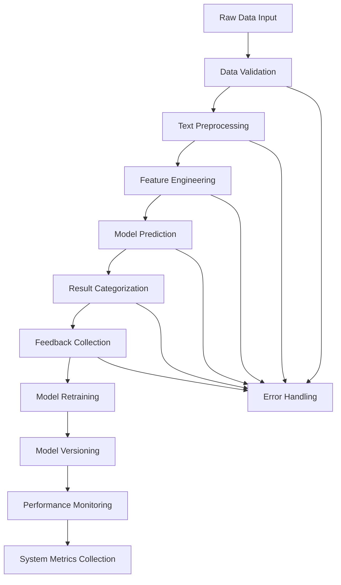

# Application Flow

## Data Categorization Flowchart

## Flow Explanation

1. **Data Input**
   - Accepts raw text and structured data from various sources
   - Validates data format and content

2. **Preprocessing**
   - Cleans and normalizes text data
   - Handles missing values and data inconsistencies

3. **Feature Engineering**
   - Generates text embeddings and numerical features
   - Stores processed features in feature store

4. **Model Prediction**
   - Loads current model version
   - Makes predictions based on processed features
   - Returns categorized results with confidence scores

5. **Feedback Collection**
   - Collects user feedback on predictions
   - Stores feedback for model improvement

6. **Model Retraining**
   - Uses collected feedback for retraining
   - Evaluates new model performance
   - Deploys improved model version

7. **Monitoring**
   - Tracks model performance metrics
   - Monitors system health and resource usage
   - Generates alerts for critical issues